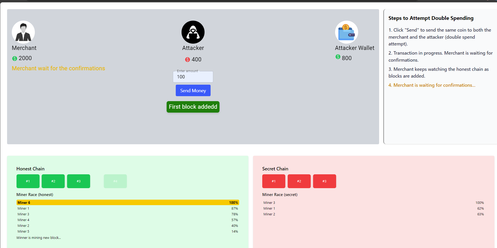
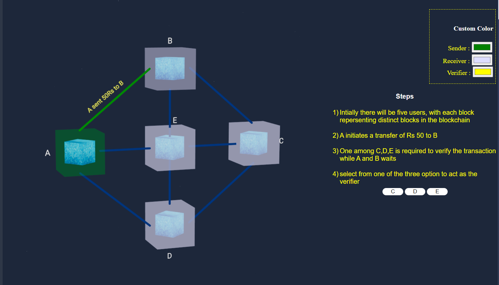

<u><h3>Procedure</h3></u>

<h4>Centralized Database Double-Spending</h4>

<ol>

<li>

Please refer to the right-hand section of the interface to start the simulation 
</li>

<li>
Within the "Double Spending" sidebar, you will find two options: "Centralized" and "Blockchain."
</li>

<li>
By default, the "Centralized" option is active. Below the "Centralized" option, you will find a section or text box that provides the definition of double spending within a centralized database.
Read the definition to understand how double spending occurs in a centralized system.

 

 
 

 

 Click the play button to start the simulation.
 

</li>

<li>

 On the main interface, you will find two input fields labeled "Recipient" and "Amount."
 

</li>
 

 
 

<li>

Click on the "Recipient" input field to select or input the name or address of the intended receiver.

</li>

<li>

Click on the "Amount" input field to specify the exact amount you wish to send in the transaction.

</li>

<li>

Ensure the recipient's information and the transaction amount are accurately entered.

</li>

<li>

After confirming the details, click the "Send" button to initiate the transaction.

</li>
<li>

Upon initiating the transaction, the left side three-dimensional animation initializes. The animation should display user-specific information, including the user's name, balance, and the recipient's name and balance.
 

 
 

</li>
<li>

Below the animation, users can view a step-by-step breakdown of how the bank processes a demand draft. Within the instruction panel, users can access a "Cancel Request" button, allowing them to observe in real-time how double spending unfolds in the context of a bank's demand draft process, providing insights into potential vulnerabilities in centralized systems.

 
 

</li>

</ol>

<h4>Blockchain Database Double-Spending</h4>

<ol>
<li>

Look for the sidebar labeled "Double Spending" on the right side of the app interface 
</li>

<li>
Within the "Double Spending" sidebar, you will find two options: "Centralized" and "Blockchain."
</li>

<li>
Select the Blockchain option. Below the "Blockchain" option, you will find a section or text box that provides the definition of double spending within a Blockchain database.
Read the definition to understand how double spending occurs in a blockchain system.

 

 
 

 

 Click the play button to start the simulation.
 

</li>
<li>

The four sections on the main interface, namely 3D animation, custom color, steps, and user account, provide a comprehensive and user-friendly experience for interacting with the application and gaining insights into the transaction process.
 

 
 
<b>3D animation - </b>The 3D animation section visually illustrates to the user how double spending is prevented and managed within a blockchain system, enhancing their understanding of the technology's security features.
 

 
 

 

 
<b>Custom Color - </b>The "Custom Color" section features three input options that allow users to customize and change the colors of the blocks corresponding to the receiver, verifier, and sender, adding a personalized touch to the visualization of the transaction process.
 

 
 

 

 
<b>Steps - </b>
The "steps" panel is designed to guide users through the intricate process of preventing double spending in a blockchain system
 

 
 

 

  
<b>User Account - </b>
<li>

 On the main interface, you will find two input fields labeled "Recipient" and "Amount."
 

</li>

<li>

Click on the "Recipient" input field to select or input the name or address of the intended receiver.

</li>

<li>

Click on the "Amount" input field to specify the exact amount you wish to send in the transaction.

</li>

<li>

Ensure the recipient's information and the transaction amount are accurately entered.

</li>

<li>

After confirming the details, click the "Send" button to initiate the transaction.

</li>
 

 
 

 

</li>

Upon initiating the transaction, the left side three-dimensional animation initializes.
 

 
 

</li>
</ol>

