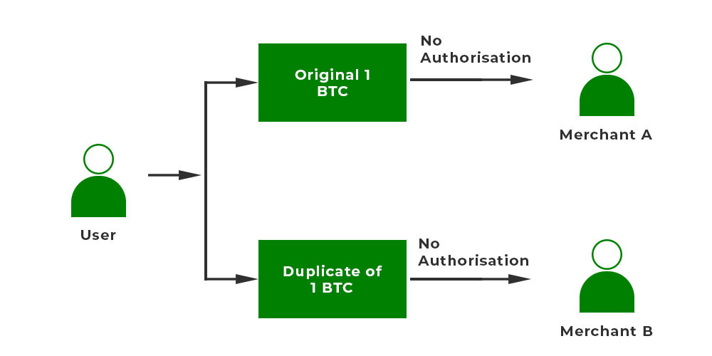

<u><h3>Theory</h3></u>
<b>

Double Spending 

</b>

 
Double spending is a fraudulent activity in which a person attempts to spend the same digital currency or asset more than once, exploiting vulnerabilities in the system. It poses a significant risk in both centralized databases and blockchain systems. Preventing double spending involves verifying transactions, implementing concurrency control, logging and auditing, ensuring atomicity, and employing unique transaction identifiers. While centralized databases rely on trust in a central authority to prevent double spending, blockchain uses decentralized consensus mechanisms to secure against it..
 
 

<b>

Double Spending in centralized database

</b>

Double spending in a centralized database system refers to a situation where a user attempts to spend the same funds more than once by exploiting potential vulnerabilities in the system. In the context of demand drafts, double spending could occur if someone tries to present the same demand draft to two different entities for payment..

 

<b>

Double Spending in centralized database 

</b>

In a blockchain, every transaction is registered as a block, forming a chronological chain. When a user initiates a cryptocurrency transaction, the network verifies its validity. However, a malicious actor may concurrently broadcast conflicting transactions, such as sending the same cryptocurrency to two different recipients. If the network fails to promptly reach a consensus or validate one transaction over the other, it can result in the risk of double spending..

 

