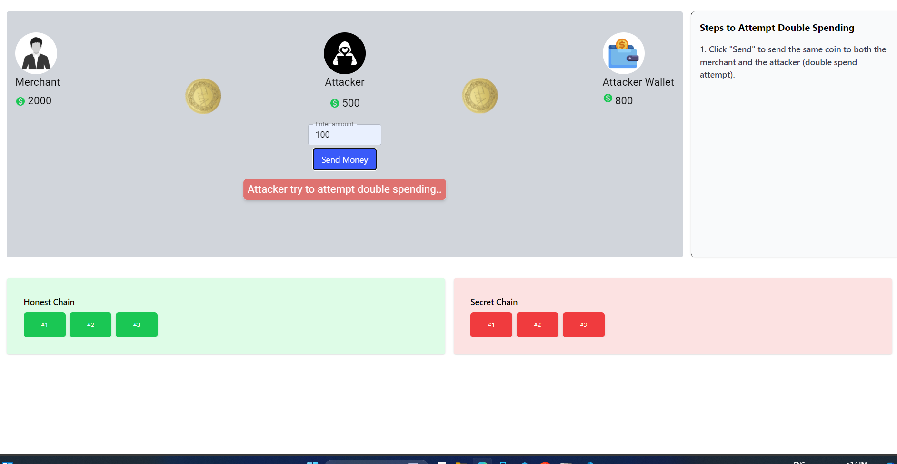
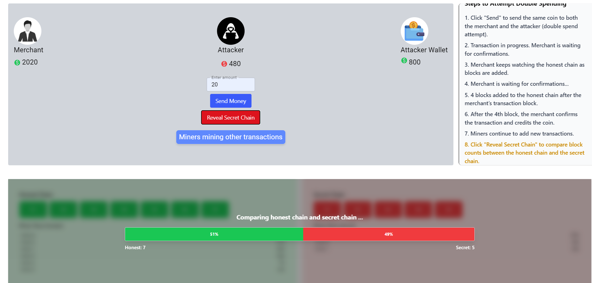

In this interactive transaction simulation, users can experience how blockchain prevents the problem of double spending. 
The app allows users to initiate a transaction by selecting a recipient and entering the amount to be sent. 
As the process runs, a step-by-step three-dimensional animation illustrates how the blockchain network ensures security, 
while highlighting the difference from traditional centralized systems. The simulation demonstrates that while a centralized 
system is vulnerable to double spending, blockchain prevents it through transparency, immutability, and consensus.

<ol>

<li>

The simulation begins by setting up two chains for comparison: 
an <b>honest chain</b> with more miners (faster growth) and an <b>attacker’s secret chain</b> with fewer miners (slower growth). 
Click on the <b>Go to Simulation</b> button to start.

</li>

<li>

Enter an amount to send (must not exceed the attacker’s available balance).

</li>

<li>

The transaction is now initiated.

</li>

<li>

Both honest miners and attacker’s miners begin solving the Proof-of-Work puzzle to mine their respective transactions. 

</li>

<li>

Initially, one of the honest miners solves the puzzle faster (shown in yellow) and successfully mines a block on the honest chain. 

</li>

<li>

The honest chain adds the attacker–merchant transaction. Honest miners then continue to mine the next transactions on the chain. 

</li>

<li>

The merchant confirms the transaction after <b>four additional blocks</b> are added on top of the block containing the transaction 
(confirmation depth).

</li>

<li>

Once this stage is complete, the <b>Reveal Secret Chain</b> button becomes active. 
Clicking it reveals the attacker’s secret chain. 
The blockchain network then compares the honest chain and the attacker’s chain using the <b>longest chain rule</b>.

</li>

<li>

The blockchain network selects the honest chain as the valid chain since it contains more blocks 
and therefore represents more accumulated Proof of Work. 
This proves that the attacker’s attempt to double spend has failed.

</li>

</ol>

